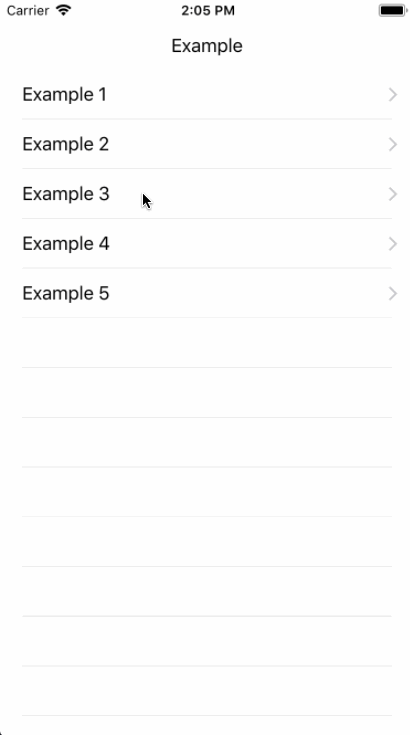

# JCCNavigationController
一种导航栏一体化转场动画效果

# Usage

## AppDelegate


```swift
func application(_ application: UIApplication, didFinishLaunchingWithOptions launchOptions: [UIApplicationLaunchOptionsKey: Any]?) -> Bool {
    // Override point for customization after application launch.

    self.window = UIWindow.init(frame: UIScreen.main.bounds)
    let dashboardController = IHSDashboardController.init()
    self.window?.rootViewController = JCCNavigationController.init(rootViewController: self.dashboardController!)
    self.window?.makeKeyAndVisible()

    return true
}
```

## UITableView

```swift
func tableView(_ tableView: UITableView, didSelectRowAt indexPath: IndexPath) {
    let detailViewController : IHSCookDetailViewController = IHSCookDetailViewController.init()
    self.jccNavigationController.pushViewController(viewController: detailViewController)

    tableView.deselectRow(at: indexPath, animated: true)
}
```

# Screenshot

